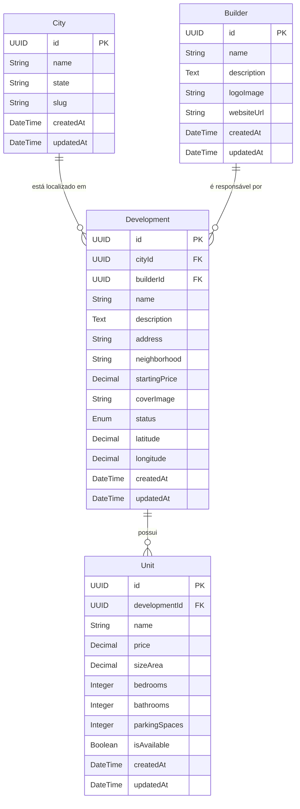

# ERD — Diagrama de Entidade-Relacionamento

> **O que é um ERD?**
> O ERD (Entity-Relationship Diagram) é o mapa do banco de dados. Ele não lista apenas as tabelas e seus campos — ele documenta *como* as entidades se relacionam entre si, e com qual multiplicidade (cardinalidade). É um dos primeiros artefatos criados na fase de modelagem de dados de qualquer sistema.

---

## Cardinalidades — Guia Rápido

| Notação  | Significado                                              |
|----------|----------------------------------------------------------|
| `1..1`   | Exatamente um (obrigatório)                              |
| `0..1`   | Zero ou um (opcional)                                    |
| `1..N`   | Um para muitos (obrigatório ter ao menos um)             |
| `0..N`   | Zero para muitos (pode não ter nenhum)                   |
| `N..N`   | Muitos para muitos (exige tabela de junção intermediária)|

---

## Diagrama (formato Mermaid)



---

## Análise dos Relacionamentos

### `City` → `Development` (1 para N)
```
Uma City pode ter MUITOS Developments.
Um Development pertence a EXATAMENTE UMA City.
```
**Impacto no banco:** A tabela `Development` armazena o campo `cityId` como **Foreign Key**. Não existe uma tabela de junção porque é um relacionamento simples 1:N.

**Por que isso importa?** Ao filtrar empreendimentos por cidade (RF02), o backend fará um simples `WHERE city_id = ?`, sem precisar de operações custosas de JOIN em tabelas de junção.

---

### `Builder` → `Development` (1 para N)
```
Uma Builder pode ser responsável por MUITOS Developments.
Um Development pertence a EXATAMENTE UMA Builder.
```
**Impacto no banco:** A tabela `Development` armazena o campo `builderId` como **Foreign Key**.

**Por que isso importa?** Garante que os dados da construtora sejam armazenados em um único lugar (`Builder`) e referenciados em todos os empreendimentos por ID. Se o nome da construtora mudar, você atualiza *uma* linha na tabela `Builder`, e todos os empreendimentos já refletem a mudança automaticamente.

---

### `Development` → `Unit` (1 para N)
```
Um Development pode ter MUITOS Units (tipologias/plantas).
Um Unit pertence a EXATAMENTE UM Development.
```
**Impacto no banco:** A tabela `Unit` armazena o campo `developmentId` como **Foreign Key**.

**Por que isso importa?** Para exibir as plantas de um empreendimento (RF04), o backend fará `WHERE development_id = ?`. A exclusão de um empreendimento pode ser configurada para excluir suas Units em cascata (`ON DELETE CASCADE`).

---

## Ausência de relacionamento N:N

> **Por que não temos tabelas de junção?**
> Nenhum relacionamento neste domínio é Muitos para Muitos (N:N). Um empreendimento pertence a uma cidade (não a várias), pertence a uma construtora (não a várias), e uma planta pertence a um empreendimento (não a vários). Isso mantém o schema simples e eficiente para o MVP.

Se no futuro houver, por exemplo, **múltiplas fotos por empreendimento** (galeria de imagens), precisaríamos de uma entidade `DevelopmentImage` com FK para `Development` — um novo 1:N. Ainda sem N:N.

---

## Referências entre arquivos
- **Entidades detalhadas com tipos:** [entities.md](entities.md)
- **Como esses relacionamentos são expostos via API:** [architecture.md](architecture.md)
